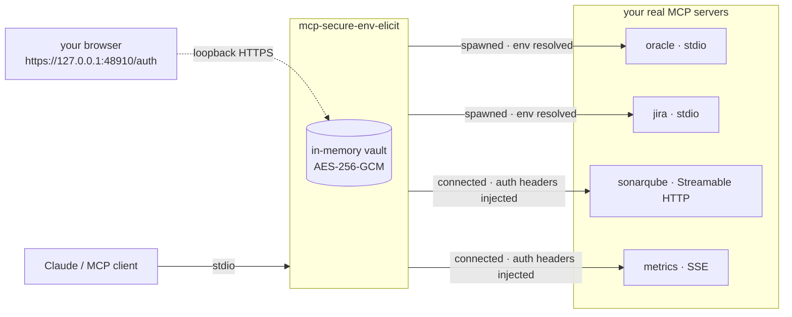
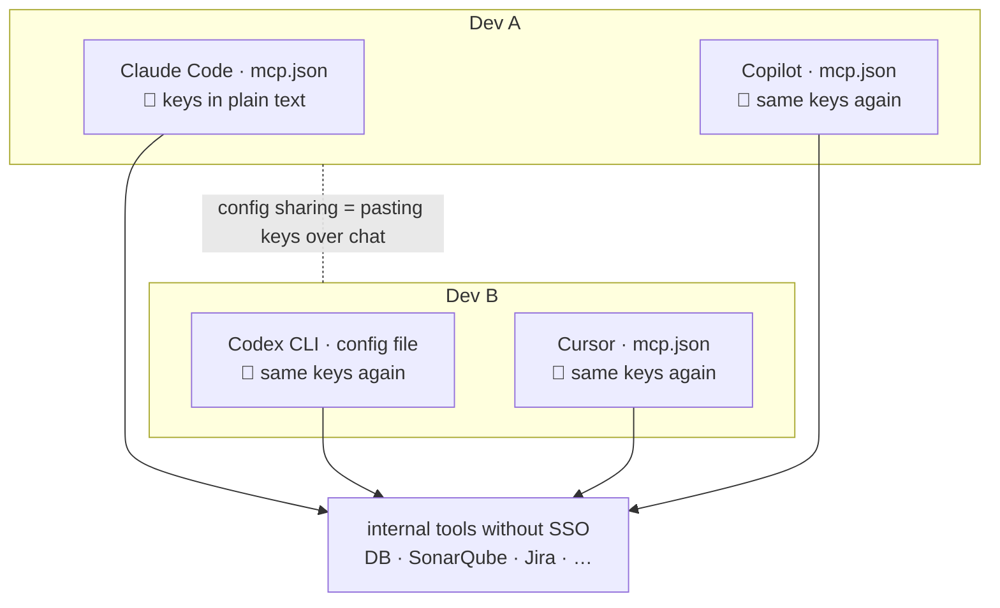
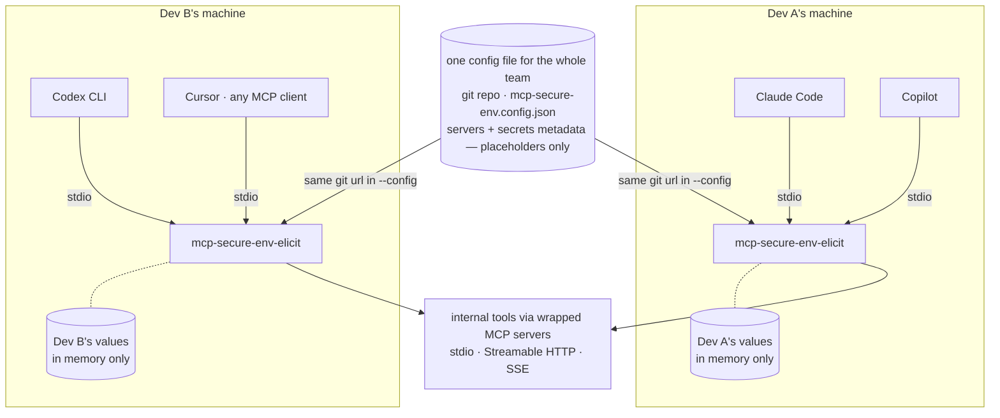
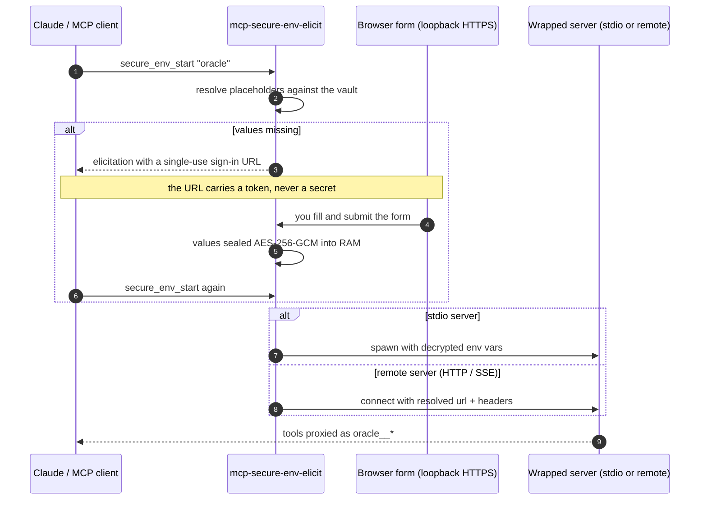
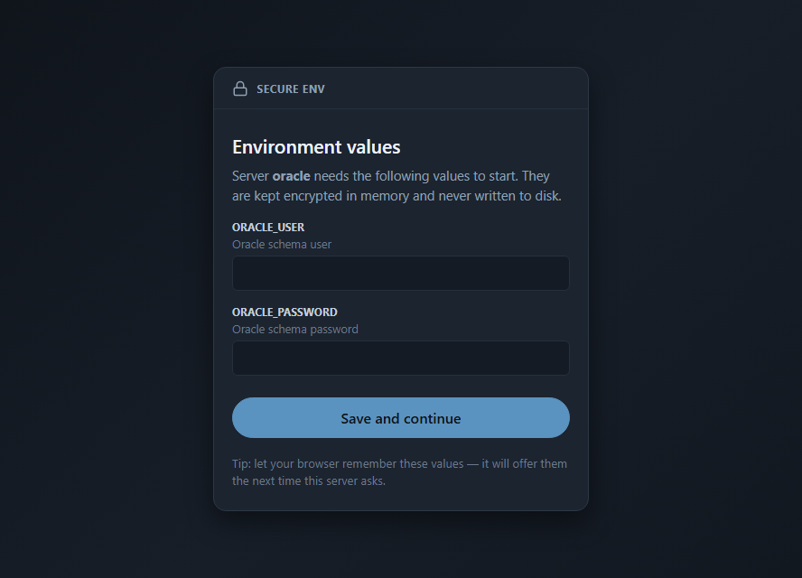
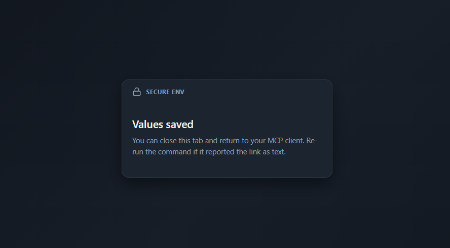

# @grec0/mcp-secure-env-elicit

**Stop putting secrets in your `mcp.json`.** This MCP server is a wrapper that launches other MCP servers for you: their config lives inside this package's config file with `${secure:…}` placeholders instead of real values, and when a server needs to start, the missing values are collected from you through a browser form (MCP URL elicitation) and kept **AES-256-GCM encrypted in memory** — never written to disk, never visible to the model or the MCP client.



## Why

Most companies never get SSO wired into every internal tool: the database has its own credentials, SonarQube its own token, Jira yet another one. So each developer wires up their own MCP servers by hand, configs get passed around over chat with no agreed format, and the same API keys end up duplicated **in plain text** across every agent's config on every machine — files that then land in dotfile repos, screenshots, and backups:



This wrapper flips that picture. MCP is the one interface every coding agent already speaks — Claude Code, Claude Desktop, Copilot, Codex CLI, Cursor, whatever comes next — so the wrapper becomes the **single place** where env secrets are handled. Every agent of every dev points at the **same** wrapper config (a local file or a shared git repo) that contains **placeholders only**; each dev types the real values once per session, and they live encrypted in that process's memory and nowhere else:



The result: **one file in one repo** describes every server and every secret's *metadata* for the whole team — every agent of every dev reads the same config, the MCP client config contains **zero secrets**, and onboarding a new dev (or a new agent) is "point it at the repo". The only thing that stays per-person is the secret *values*, typed by each dev into their own local form and held only in their own wrapper's memory — no key handover, ever.

## How it works

The wrapper sits between your MCP client and the real servers. It speaks stdio to the client, proxies every tool of every child it spawns, and owns the only copy of your secret values — sealed in an in-memory vault.



The life of a secret, start to finish:

1. **Declared.** The wrapper config references it as `${secure:ORACLE_PASSWORD}` — inside `env` values or `args` for stdio servers, inside `headers` or the `url` for remote ones. No real value exists anywhere in any file.
2. **Requested.** When a server starts and some of its placeholders have no value in the vault yet, the wrapper raises a **URL-mode elicitation**. Clients that support it pop a dialog that opens the sign-in page; clients that don't receive the URL in the tool result — open it manually and re-run the command after submitting. Links are **single-use** and stay valid for the **whole 10-minute window**, even if the tool call already returned.
3. **Collected.** You type the values into the form and submit. They travel **only over loopback HTTPS**, straight from your browser into the wrapper process — never through the MCP protocol, so neither the model nor the client ever sees them. There is deliberately no "set secret" tool.
4. **Sealed.** Each value is immediately encrypted with **AES-256-GCM** under a key minted at process start and held only in the wrapper's memory. Nothing is ever written to disk.
5. **Used.** Values are decrypted only at spawn time, directly into the child's environment (or into the request headers of a remote server). The same `NAME` shared by several servers is asked once and reused.
6. **Gone.** The key and every value die with the process. Restart your MCP client and you'll be asked again — that's the price of never persisting anything, softened by browser autofill (see [Trusted TLS](#trusted-tls--browser-autofill)).

This is what the operator actually sees — the sign-in form for the `oracle` example below, and the confirmation after submitting (`dark` theme):

<p align="center">
  
  
</p>

## Quick start

**1.** Add the wrapper to your MCP client (e.g. `.mcp.json` for Claude Code):

```json
{
  "mcpServers": {
    "secure-env": {
      "type": "stdio",
      "command": "npx",
      "args": ["-y", "@grec0/mcp-secure-env-elicit", "--config", "C:/path/to/mcp-secure-env.config.json"]
    }
  }
}
```

**2.** Write the wrapper config (`mcp-secure-env.config.json`) describing the servers to wrap:

```json
{
  "theme": "dark",
  "servers": {
    "oracle": {
      "command": "npx",
      "args": ["-y", "@grec0/mcp-oracle-db"],
      "env": {
        "ORACLE_CONNECTION_STRING": "${secure:ORACLE_USER}/${secure:ORACLE_PASSWORD}@//db.example.com:1521/XEPDB1"
      },
      "autoStart": true
    }
  },
  "secrets": {
    "ORACLE_USER": { "description": "Oracle schema user", "input": "text" },
    "ORACLE_PASSWORD": { "description": "Oracle schema password" }
  }
}
```

**3.** Use it. Ask your client to call `secure_env_start` with `{"server": "oracle"}` (or let `autoStart` do it). If values are missing you get a link like `https://127.0.0.1:48910/auth?token=…` — open it, fill the form, submit, run the command again. Done: the oracle tools now appear as `oracle__<tool>`.

## Placeholders

`${secure:NAME}` works anywhere inside `env` values or `args` strings for stdio servers, and inside `headers` values or the `url` for remote ones — including embedded in larger strings (connection URLs, DSNs, `Bearer …` prefixes).

Optionally pick the form widget: `${secure:NAME:type}` with `text`, `password`, `email`, `number`, `url` or `tel`. Types can also be set in the `secrets` metadata (`"input": "email"`). When nothing is explicit, the widget is inferred from the name: variables matching `PASSWORD`, `PASS`, `PWD`, `SECRET`, `TOKEN`, `API_KEY`, `ACCESS_KEY`, `PRIVATE_KEY`, `CREDENTIAL`, `AUTH` render as password inputs; names containing `MAIL` render as email inputs.

## Shared config in a git repo

Instead of a local path, `--config` accepts a **git URL** — so one repo (private is fine) holds the team's wrapper config, and every dev just points at it:

```json
"args": ["-y", "@grec0/mcp-secure-env-elicit", "--config", "https://git.example.com/org/mcp-configs.git#teams/backend.json"]
```

- The `#path/inside/repo.json` fragment names the file (or use `--config-file <path>`); without it, `mcp-secure-env.config.json` at the repo root is assumed.
- The repo is cloned shallowly on the **default branch** into `~/.mcp-secure-env-elicit/repos/`. Only the first-ever start pays for the network: afterwards the cached copy is used immediately and refreshed **in the background**, so startup stays well inside MCP client connect timeouts and config changes reach each dev on their *next* restart.
- Tip: MCP clients typically allow ~30s for a server to start, and a cold `npx` download plus the first clone can exceed it. If the very first connection times out, just reconnect — everything is cached by then. Pinning an exact version (`@grec0/mcp-secure-env-elicit@x.y.z`) also makes npx noticeably faster on slow networks.
- Authentication rides on the **system git**: Git Credential Manager on Windows, SSH keys, cached HTTPS credentials — whatever already lets the dev `git clone` that repo works here too. No extra tokens to mint: grant read access to the repo and that is it. (First time ever on a machine, run `git clone <url>` once in a terminal — or let the credential manager's window appear — so the credentials get cached.)
- **Offline-friendly:** if the remote is unreachable but a cached clone exists, the cached copy is used with a warning — being off VPN never blocks startup.
- Remember the config contains **placeholders only**, so read access to the repo reveals no secret values; each dev still provides their own through the local sign-in form.

## Remote servers (HTTP / SSE)

Not every MCP server is a local process. Entries with a `type` of `http`, `https`, or `sse` connect to a **remote** MCP endpoint instead of spawning one, and their `headers` (and even the `url`) accept the same placeholders:

```json
{
  "servers": {
    "sonarqube": {
      "type": "https",
      "url": "https://tools.example.com/sonar-mcp-server/mcp",
      "headers": { "SONARQUBE_TOKEN": "${secure:SONARQUBE_TOKEN}" }
    },
    "db": {
      "type": "sse",
      "url": "https://tools.example.com/mcp-sse-db/sse",
      "headers": { "X-Api-Key": "${secure:DB_API_KEY}" },
      "insecureTls": true
    }
  }
}
```

- `http` / `https` use the modern **Streamable HTTP** transport and automatically fall back to SSE if the endpoint turns out to be a legacy one — so `"type": "https"` works for both kinds without you having to know.
- `sse` forces the legacy SSE transport (headers are sent on the stream request too).
- `insecureTls: true` accepts a server certificate that is not publicly trusted (self-signed or internal CA), scoped to that server's requests only. It covers requests made by the *wrapper*; a **stdio** child that talks to an internal host itself needs TLS configured in its own `env` instead (for Node ≥ 22.15 children: `"NODE_USE_SYSTEM_CA": "1"`, or `NODE_EXTRA_CA_CERTS`).
- No `type` (or `"type": "stdio"`) keeps the spawn behaviour: `command`, `args`, `env`, `cwd`.

## Tools

| Tool | Description |
|---|---|
| `secure_env_status` | State of each configured server: `stopped`/`starting`/`running`/`error`, missing secret **names** (never values), pending sign-in URL, tool count. |
| `secure_env_start` | Start a server. Returns the sign-in URL if values are missing; call again after submitting. |
| `secure_env_stop` | Stop a running server and remove its tools. |
| `<server>__<tool>` | Every tool of every running child, forwarded verbatim (schema included). The tool list refreshes via `notifications/tools/list_changed`. |

## Trusted TLS & browser autofill

The sign-in page must be HTTPS (MCP clients only open `https:` URLs for elicitation), so the wrapper auto-generates a self-signed certificate under `~/.mcp-secure-env-elicit/tls/`. It works as-is, but browsers refuse to *save* passwords on untrusted pages — trust the certificate once with `npx -y @grec0/mcp-secure-env-elicit trust-cert` (restart the browser afterwards) and your password manager will offer to remember the values and refill them in two clicks after every restart. Prefer your own certificate ([mkcert](https://github.com/FiloSottile/mkcert), an internal CA, or a real domain pointed at `127.0.0.1`)? Set `"tls": { "certPath": "…", "keyPath": "…" }` in the config. Keep `PORT` stable (default `48910`): autofill is keyed to the page origin.

## Themes

The sign-in page ships with several looks: `light` (default), `dark`, `ocean`, `forest`, `terminal`, `sunset`. Pick one with:

- `--theme dark` on the command line, or
- `MCP_SECURE_ENV_THEME=dark`, or
- `"theme": "dark"` in the config file.

## Configuration reference

| Where | What |
|---|---|
| `--config <path or git url>` / `MCP_SECURE_ENV_CONFIG` | Config file location — a local path or a `…repo.git[#file]` URL (see *Shared config in a git repo*). Defaults: `./mcp-secure-env.config.json`, then `~/.mcp-secure-env-elicit/config.json`. |
| `--config-file <path>` | File inside the config repo when `--config` is a git URL and has no `#fragment`. |
| `--theme <name>` / `MCP_SECURE_ENV_THEME` / `"theme"` | Sign-in page theme. |
| `HOST` / `PORT` | Loopback server binding. Defaults `127.0.0.1:48910`. Keep the port stable for browser autofill. |
| `"servers"` (stdio) | `command`, `args`, `env` (with placeholders), optional `cwd`, optional `autoStart`. Server names cannot contain `_`. |
| `"servers"` (remote) | `type` (`http`/`https`/`sse`), `url`, `headers` (with placeholders), optional `insecureTls`, optional `autoStart`. |
| `"secrets"` | Optional per-secret `description` and `input`. |
| `"tls"` | Optional `certPath`/`keyPath` for a trusted certificate. |

Note on `autoStart`: servers whose secrets are still missing are **not** prompted at boot — a wrapper hosts many servers and asking for everything on startup would be a wall of prompts. They wait quietly and elicit when first started (`secure_env_start`).

## Security model, honestly

- Secret values are held AES-256-GCM encrypted in the wrapper's memory, under a key minted per process. They are decrypted only at spawn time, directly into the child's environment.
- Nothing is ever written to disk by the wrapper except TLS material (which contains no secrets).
- Values never enter the MCP conversation: there is deliberately **no** "set secret" tool, so the model cannot be handed a secret even by accident. The only input path is the loopback form.
- Error messages are **redacted**: transport and fetch errors can echo the request URL or upstream response bodies, so every secret value (plain and percent-encoded) is scrubbed to `[secret]` before an error reaches stderr, `secure_env_status`, or a tool result. There is a regression test for it.
- The child process receives the secrets as plain environment variables — that is the contract of the servers being wrapped. Anyone able to inspect the child's environment (same OS user) can read them, exactly as if you had configured the server directly.
- Prefer placeholders in `env` over `args`: command lines are visible in process listings.

## Limitations

- Only **tools** are proxied for now (no resources or prompts).

## Development

```bash
npm install
npm run check   # lint + typecheck + tests + build
```

## License

MIT
