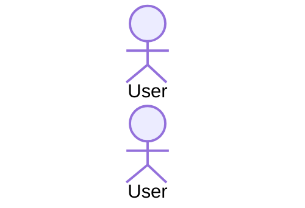

# Event Modeling

## Flow: <name>

<!-- Narrative: trigger -> command -> event(s) -> read-model/notification. -->

```mermaid
sequenceDiagram
  actor User
```

<!-- The data each event carries (field list with types). -->
